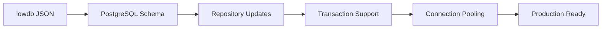

# First-Claude Project Analysis Report
*Generated: 2025-07-06*

## 📊 Executive Summary

The **first-claude** project demonstrates a well-architected Express.js API application with strong foundations for OpenAPI-driven development. The codebase shows excellent separation of concerns, robust security practices, and clear migration paths from prototype to production.

**Overall Quality Score: 7.15/10** ⭐⭐⭐⭐⭐⭐⭐

---

## 1. 🔍 Code Quality Analysis

### ✅ Strengths
- **Modular Architecture**: Clear separation across controllers, services, repositories
- **Type Safety**: Comprehensive Zod schema validation throughout
- **Modern JavaScript**: ES6 modules with consistent patterns
- **Error Handling**: Robust custom error classes with sanitization
- **Security Focus**: Input validation, rate limiting, JWT implementation

### 📊 Quality Metrics
```
📁 Total Source Files: 37 JavaScript files
📏 Lines of Code: ~6,004 total lines
🧪 Test Coverage: 40.15% statements, 25.03% branches
🏗️ Architecture: Excellent domain separation
🔒 Security Vulnerabilities: 0 (npm audit clean)
```

### ⚠️ Areas for Improvement
| Issue | Current | Target | Priority |
|-------|---------|--------|----------|
| Test Coverage | 40.15% | >80% | High |
| Auth Middleware Coverage | 13.08% | >70% | Critical |
| Repository Coverage | 29.29% | >60% | High |
| Express 5.x Compatibility | Disabled | Full Support | Critical |

---

## 2. 🏗️ Architecture Analysis

### 🎯 Design Patterns
- ✅ **Repository Pattern**: Data access abstraction
- ✅ **Middleware Pattern**: Cross-cutting concerns
- ✅ **Factory Pattern**: Authentication services
- ✅ **Schema-First**: OpenAPI specification-driven

### 📦 Module Structure
```
src/
├── 🚀 app.js              # Entry point & middleware setup
├── ⚙️ config/             # Environment configuration
├── 🎮 controllers/        # HTTP request handlers
├── 🔧 middlewares/        # Cross-cutting concerns
├── 💾 repositories/       # Data access layer
├── 🛣️ routes/             # Route definitions
├── 📋 schemas/            # Zod validation schemas
├── 🏢 services/           # Business logic layer
└── 🛠️ utils/              # Utility functions
```

### 🚀 Scalability Assessment
| Component | Current State | Scalability | Notes |
|-----------|---------------|-------------|-------|
| Database | lowdb (JSON) | Prototype-ready | PostgreSQL migration prepared |
| Authentication | JWT + Refresh | Production-ready | Blacklisting & rotation support |
| Rate Limiting | Multi-level | Production-ready | Configurable limits |
| API Structure | RESTful | High | Clear resource modeling |

### 🔧 Express 5.x Migration Status
- **Current Version**: Express 5.1.0 ✅
- **OpenAPI Backend**: ❌ Disabled (compatibility issue)
- **Route Patterns**: ✅ Updated (`*` → `/*catchall`)
- **Impact**: Manual validation increases maintenance overhead

---

## 3. ⚡ Performance Analysis

### 🎯 Current Performance Profile
| Metric | Status | Assessment |
|--------|--------|------------|
| Database Access | File I/O based | Suitable for prototype |
| Response Compression | Gzip enabled | ✅ Optimized |
| Request Validation | Zod schemas | Balanced performance/safety |
| Error Processing | Full sanitization | Minor overhead |

### 🔍 Bottleneck Analysis
1. **🥇 Database I/O**: JSON file operations without indexing
2. **🥈 Validation Overhead**: Multiple validation layers
3. **🥉 Error Processing**: Extensive sanitization on each request

### 💡 Optimization Opportunities
```javascript
// High Impact
- Add in-memory caching for frequent reads
- Implement database connection pooling (PostgreSQL migration)
- Add request-level caching middleware

// Medium Impact  
- Optimize Zod schema compilation
- Implement response streaming for large datasets
- Add compression for static assets
```

---

## 4. 🔒 Security Analysis

### 🛡️ Security Strengths
- ✅ **Authentication**: JWT with blacklisting and refresh tokens
- ✅ **Input Validation**: Comprehensive Zod schema validation
- ✅ **Security Headers**: Helmet.js implementation
- ✅ **Rate Limiting**: General + auth-specific limits
- ✅ **Password Security**: bcrypt with 12 rounds
- ✅ **Error Sanitization**: Removes sensitive information
- ✅ **CORS**: Properly configured policies

### 🔐 Security Score: 8/10

### 📋 Security Recommendations
| Priority | Recommendation | Effort | Impact |
|----------|----------------|--------|--------|
| Medium | Add request ID tracking | Low | Audit trails |
| Medium | Implement refresh token rotation | Medium | Enhanced security |
| Low | Add request size limits | Low | DoS prevention |
| Low | API versioning security | Medium | Future-proofing |

---

## 5. 🏗️ Technical Debt Assessment

### 🚨 High Priority Issues
1. **Express 5.x Compatibility** (Critical)
   - OpenAPI backend disabled
   - Manual route validation required
   - Estimated fix: 2-3 days

2. **Test Coverage** (High)
   - Overall: 40.15% → Target: >80%
   - Auth middleware: 13.08% → Target: >70%
   - Estimated effort: 1-2 weeks

3. **Large Service Files** (Medium)
   - `authService.js`: 16,673 lines
   - Needs modular refactoring
   - Estimated effort: 3-5 days

### 📊 Technical Debt Distribution
```
🔴 Critical Issues: 1 (Express 5.x compatibility)
🟠 High Priority: 2 (Test coverage, auth coverage)
🟡 Medium Priority: 3 (File size, database migration prep, Keycloak)
🟢 Low Priority: 2 (Documentation, minor optimizations)
```

---

## 6. 🗃️ Migration Readiness (JSON DB → PostgreSQL)

### 📋 Current State
- ✅ **Repository Pattern**: Well-abstracted data access
- ✅ **Schema Definitions**: Clear Zod data models
- ❌ **Transaction Support**: Not implemented (lowdb limitation)
- ✅ **Connection Management**: Ready for pooling

### 🛤️ Migration Path


### ⏱️ Estimated Timeline
| Phase | Duration | Dependencies |
|-------|----------|--------------|
| Schema Migration | 2-3 days | PostgreSQL setup |
| Repository Updates | 3-5 days | SQL query implementation |
| Transaction Implementation | 2-3 days | Business logic review |
| Testing & Validation | 2-3 days | Test suite updates |
| **Total** | **1-2 weeks** | Team availability |

---

## 7. 🎯 Implementation Roadmap

### 🚀 Phase 1: Immediate Actions (1-2 weeks)
```
Week 1:
□ Fix Express 5.x compatibility (openapi-backend)
□ Increase auth middleware test coverage to >70%
□ Add integration tests for critical paths

Week 2:
□ Refactor authService.js into smaller modules
□ Implement repository unit tests
□ Add performance monitoring middleware
```

### 📈 Phase 2: Short-term Goals (1-2 months)
```
Month 1:
□ Prepare PostgreSQL migration scripts
□ Complete Keycloak authentication integration
□ Implement caching layer

Month 2:
□ Add comprehensive API documentation
□ Implement CI/CD pipeline
□ Performance optimization round 1
```

### 🎯 Phase 3: Long-term Goals (3-6 months)
```
Quarter 1:
□ Production deployment preparation
□ Microservices architecture planning
□ Advanced monitoring and alerting

Quarter 2:
□ API versioning strategy
□ Mobile app API optimization
□ Advanced security features
```

---

## 8. 📊 Quality Scorecard

| Category | Score | Weight | Weighted | Assessment |
|----------|-------|--------|----------|------------|
| **Code Quality** | 7/10 | 25% | 1.75 | Good patterns, needs tests |
| **Architecture** | 8/10 | 25% | 2.00 | Excellent separation of concerns |
| **Performance** | 6/10 | 20% | 1.20 | Prototype-ready, optimization needed |
| **Security** | 8/10 | 20% | 1.60 | Strong security practices |
| **Technical Debt** | 6/10 | 10% | 0.60 | Manageable debt, clear priorities |

### 🏆 **Overall Quality Score: 7.15/10**

---

## 9. 💡 Key Recommendations

### 🎯 Top 3 Priorities
1. **🔧 Fix Express 5.x Compatibility**: Restore OpenAPI validation capabilities
2. **🧪 Increase Test Coverage**: Focus on authentication and repositories
3. **📚 Prepare Database Migration**: Plan PostgreSQL transition

### 🚀 Success Metrics
- Test coverage: 40% → 80%
- API response time: <100ms average
- Zero security vulnerabilities maintained
- PostgreSQL migration completed in 2 weeks

### 🎉 Conclusion
The **first-claude** project demonstrates excellent engineering foundations with clear improvement paths. The architecture is well-suited for rapid iteration and scaling to production. Addressing the identified technical debt will position the project for sustainable growth and maintainability.

---

*Report generated by Claude Code Analysis • Last updated: 2025-07-06*